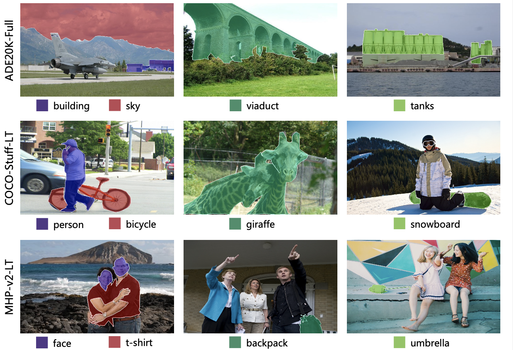

# Long-tailed Semantic Segmentation

By **Shan Li**, **Lu Yang**, **Pu Cao**, **Liulei Li**, **Huadong Ma**

[paper](https://ieeexplore.ieee.org/abstract/document/10542424)

<p align="center"></p>


### Features
* Mask2Former and DeepLabV3Plus for long-tailed semantic segmentation (ltss).
* Support major ltss datasets: ADE20K-Full, COCO-Stuff-LT, MHP-v2-LT.
* Support Repeat Factor Sampling (RFS), Copy-Paste, Seesaw Loss (only for Mask2Former) solutions.

## Installation

See [installation instructions](INSTALL.md).

## Getting Started

See [Preparing Datasets for LTSS](datasets/README.md).

See [Getting Started with LTSS](GETTING_STARTED.md).


## LTSS Datasets

### Statistics of LTSS Datasets 
<table>
<thead>
  <tr>
     <th align="center" rowspan="1">Datasets</th>
     <th align="center" rowspan="1">#Images</th>
     <th align="center" rowspan="1">#Train/Val/Test/</th>
     <th align="center" rowspan="1">#Classes</th>
     <th align="center" rowspan="1">Gini@Image</th>
     <th align="center" rowspan="1">Gini@Pixel</th>
     <th align="center" rowspan="1">Download</th>
  </tr>
</thead>
<tbody>
  <tr>
     <td align="center" style="font-weight:normal">  ADE20K-Full </td>
     <td align="center" style="font-weight:normal">  27,574 </td>
     <td align="center" style="font-weight:normal">  25,574/2,000/-   </td>
     <td align="center" style="font-weight:normal">  847  </td>
     <td align="center" style="font-weight:normal">  0.865  </td>
     <td align="center" style="font-weight:normal">  0.934   </td>
     <td align="center" style="font-weight:normal">  -  </td>
  </tr>
  <tr>
     <td align="center" style="font-weight:normal">  COCO-Stuff-LT </td>
     <td align="center" style="font-weight:normal">  87,614 </td>
     <td align="center" style="font-weight:normal">  40,679/5,000/40,670  </td>
     <td align="center" style="font-weight:normal">  171      </td>
     <td align="center" style="font-weight:normal">  0.669  </td>
     <td align="center" style="font-weight:normal">  0.773  </td>
     <td align="center" style="font-weight:normal">  -  </td>
  </tr>
  <tr>
     <td align="center" style="font-weight:normal">  MHP-v2-LT </td>
     <td align="center" style="font-weight:normal">  16,931 </td>
     <td align="center" style="font-weight:normal">  6,931/5,000/5,000  </td>
     <td align="center" style="font-weight:normal">  59  </td>
     <td align="center" style="font-weight:normal">  0.701  </td>
     <td align="center" style="font-weight:normal">  0.909  </td>
     <td align="center" style="font-weight:normal">  -  </td>
  </tr>
</tbody>
</table>

- ADE20K-Full is an extended version of ADE20K, which is proposed in [MaskFormer](https://github.com/facebookresearch/MaskFormer)
- COCO-Stuff-LT is sampled from [COCO-Stuff-118K](https://github.com/nightrome/cocostuff), and MHP-v2-LT is sampled from [MHPv2-15K](https://lv-mhp.github.io/dataset).


## Model Zoo and Baselines

### 1. Baseline models (Mask2Former-R50):
<table>
<thead>
  <tr>
     <th align="center" rowspan="2">Datasets</th>
     <th align="center" rowspan="2">mIoU</th>
     <th align="center" colspan="3">Image-level</th>
     <th align="center" colspan="3">Pixel-level</th>
     <th align="center" rowspan="2">ckpts</th>
  </tr>
  <tr>
     <td align="center" ><b>mIoU@r</b></td>
     <td align="center" ><b>mIoU@c</b></td>
     <td align="center" ><b>mIoU@f</b></td>
     <td align="center" ><b>mIoU@r</b></td>
     <td align="center" ><b>mIoU@c</b></td>
     <td align="center" ><b>mIoU@f</b></td>
  </tr>
</thead>
<tbody>
  <tr>
     <td align="center" style="font-weight:normal">  ADE20K </td>
     <td align="center" style="font-weight:normal">  47.2 </td>
     <td align="center" style="font-weight:normal">  -  </td>
     <td align="center" style="font-weight:normal">  -  </td>
     <td align="center" style="font-weight:normal">  -  </td>
     <td align="center" style="font-weight:normal">  -  </td>
     <td align="center" style="font-weight:normal">  -  </td>
     <td align="center" style="font-weight:normal">  -  </td>
     <td align="center" style="font-weight:normal">  -  </td>
  </tr>
  <tr>
     <td align="center" style="font-weight:normal">  ADE20K-Full </td>
     <td align="center" style="font-weight:normal">  18.8 </td>
     <td align="center" style="font-weight:normal">  4.8   </td>
     <td align="center" style="font-weight:normal">  13.4  </td>
     <td align="center" style="font-weight:normal">  25.1  </td>
     <td align="center" style="font-weight:normal">  3.5   </td>
     <td align="center" style="font-weight:normal">  6.2   </td>
     <td align="center" style="font-weight:normal">  28.1  </td>
     <td align="center" style="font-weight:normal">  -  </td>
  </tr>
  <tr>
     <td align="center" style="font-weight:normal">  COCO-Stuff </td>
     <td align="center" style="font-weight:normal">  46.5 </td>
     <td align="center" style="font-weight:normal">  -  </td>
     <td align="center" style="font-weight:normal">  -  </td>
     <td align="center" style="font-weight:normal">  -  </td>
     <td align="center" style="font-weight:normal">  -  </td>
     <td align="center" style="font-weight:normal">  -  </td>
     <td align="center" style="font-weight:normal">  -  </td>
     <td align="center" style="font-weight:normal">  -  </td>
  </tr>
  <tr>
     <td align="center" style="font-weight:normal">  COCO-Stuff-LT </td>
     <td align="center" style="font-weight:normal">  32.6 </td>
     <td align="center" style="font-weight:normal">  13.9  </td>
     <td align="center" style="font-weight:normal">  24.5  </td>
     <td align="center" style="font-weight:normal">  41.4  </td>
     <td align="center" style="font-weight:normal">  13.5  </td>
     <td align="center" style="font-weight:normal">  20.7  </td>
     <td align="center" style="font-weight:normal">  42.7  </td>
     <td align="center" style="font-weight:normal">  -  </td>
  </tr>
  <tr>
     <td align="center" style="font-weight:normal">  MHP-v2 </td>
     <td align="center" style="font-weight:normal">  44.6 </td>
     <td align="center" style="font-weight:normal">  -  </td>
     <td align="center" style="font-weight:normal">  -  </td>
     <td align="center" style="font-weight:normal">  -  </td>
     <td align="center" style="font-weight:normal">  -  </td>
     <td align="center" style="font-weight:normal">  -  </td>
     <td align="center" style="font-weight:normal">  -  </td>
     <td align="center" style="font-weight:normal">  -  </td>
  </tr>
  <tr>
     <td align="center" style="font-weight:normal">  MHP-v2-LT </td>
     <td align="center" style="font-weight:normal">  32.3 </td>
     <td align="center" style="font-weight:normal">  8.8  </td>
     <td align="center" style="font-weight:normal">  10.4  </td>
     <td align="center" style="font-weight:normal">  46.8  </td>
     <td align="center" style="font-weight:normal">  13.8  </td>
     <td align="center" style="font-weight:normal">  10.6  </td>
     <td align="center" style="font-weight:normal">  45.4  </td>
     <td align="center" style="font-weight:normal">  -  </td>
  </tr>
</tbody>
</table>


## License

Shield: [![CC BY-NC 4.0][cc-by-nc-shield]][cc-by-nc]

The majority of LTSS is licensed under a
[Creative Commons Attribution-NonCommercial 4.0 International License](LICENSE).

[![CC BY-NC 4.0][cc-by-nc-image]][cc-by-nc]

[cc-by-nc]: http://creativecommons.org/licenses/by-nc/4.0/
[cc-by-nc-image]: https://licensebuttons.net/l/by-nc/4.0/88x31.png
[cc-by-nc-shield]: https://img.shields.io/badge/License-CC%20BY--NC%204.0-lightgrey.svg


However portions of the project are available under separate license terms: Swin-Transformer-Semantic-Segmentation is licensed under the [MIT license](https://github.com/SwinTransformer/Swin-Transformer-Semantic-Segmentation/blob/main/LICENSE), Deformable-DETR is licensed under the [Apache-2.0 License](https://github.com/fundamentalvision/Deformable-DETR/blob/main/LICENSE).

## <a name="CitingLTSS"></a>Citing LTSS

If you use LTSS in your research or wish to refer to the baseline results published in the [Model Zoo](MODEL_ZOO.md), please use the following BibTeX entry.

```BibTeX
@article{li2024frequency,
  title={Frequency-based Matcher for Long-tailed Semantic Segmentation},
  author={Li, Shan and Yang, Lu and Cao, Pu and Li, Liulei and Ma, Huadong},
  journal={IEEE Transactions on Multimedia},
  year={2024},
  publisher={IEEE}
}
```

If you find the code useful, please also consider the following BibTeX entry.

```BibTeX
@inproceedings{cheng2022mask2former,
  title={Masked-attention Mask Transformer for Universal Image Segmentation},
  author={Bowen Cheng and Ishan Misra and Alexander G. Schwing and Alexander Kirillov and Rohit Girdhar},
  journal={CVPR},
  year={2022}
}
```

```BibTeX
@inproceedings{cheng2021maskformer,
  title={Per-Pixel Classification is Not All You Need for Semantic Segmentation},
  author={Bowen Cheng and Alexander G. Schwing and Alexander Kirillov},
  journal={NeurIPS},
  year={2021}
}
```

## Acknowledgement

Code is largely based on [detectron2](https://github.com/facebookresearch/detectron2), [MaskFormer](https://github.com/facebookresearch/MaskFormer), [Mask2Former](https://github.com/facebookresearch/Mask2Former).
